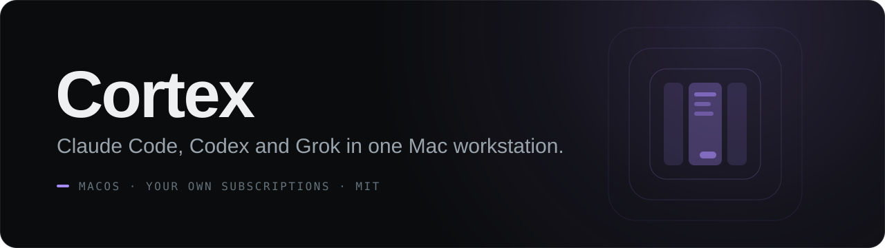
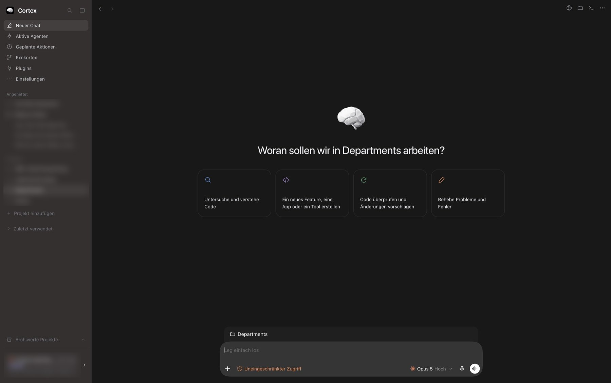
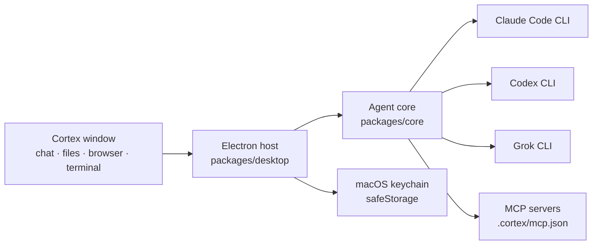

<p align="center"></p>

<p align="center">
  
  
  
  
  
</p>

<p align="center"><sub>🇩🇪 <a href="docs/HANDBUCH.md">Deutsches Handbuch</a></sub></p>

**Cortex is a standalone macOS workstation where Claude Code, Codex and Grok work side by side on your own subscriptions.**

Projects and tasks on the left, the agent chat in the centre, files, code, a browser preview and a real terminal docked on the right.
Cortex drives the providers' official CLIs; you sign in with your own accounts, and Cortex adds no AI subscription of its own.

<p align="center"></p>

## Highlights

- **Three providers, one chat.** Claude Code, Codex and Grok run through their official clients. All three share the same chat, widgets and connectors.
- **Multiple accounts per provider.** Add private and business accounts side by side. The account you pick is bound to the task, and Cortex never silently switches to another account on a limit; rule-based routing only happens in the explicit *Auto* mode.
- **Per-task diff and undo.** Each task shows an "N files edited" card with a hover diff. *Undo* restores the files to their state before the task, captured with `git stash create` (Git projects only).
- **Rewind, edit, branch.** Edit any earlier message, rewind to it, or branch a new chat from it, optionally into a separate Git worktree. The model's context forks at that exact point (`--fork-session` for Claude, `thread/fork` for Codex).
- **Reasoning slider.** Pick model and reasoning level per message, with as many steps as the model supports.
- **Widgets in the chat.** Agents answer with live cards instead of text where that reads better: timers, world clock, to-dos, test runs, quotas, deploys, colour palettes and more, all from a single `cortex-widget` JSON block.
- **Image generation on your subscription.** Create and edit images with ChatGPT · GPT Image or Grok Imagine through the provider's built-in tool, with no API key needed. Includes an editor with versions, region comments and background removal.
- **Plugins, Xcode and templates.** A catalogue of 54 reviewed MCP servers, mirrored into every provider profile; an Xcode entry that wires up `xcrun mcpbridge`; drag & drop attachments; your own templates in `~/.cortex/templates`.
- **Workspace dock.** Files with Monaco and live HTML preview, Git changes, an embedded browser and an xterm terminal, each one toggle away.
- **Local computer history (opt-in).** Text from apps you explicitly choose, encrypted on disk and summarised by the on-device Apple model. Nothing leaves the Mac, and browsers are excluded.

## Quick start

**Requirements:** macOS 13+, Node 22, pnpm 11, Xcode Command Line Tools, and an Apple Development or Developer ID signing identity (or set `CORTEX_SIGN_IDENTITY`).

```sh
git clone https://github.com/OskarSch24/cortex.git
cd cortex/engine
pnpm install
pnpm -C packages/vscode exec node esbuild.mjs --production
pnpm build
pnpm package      # builds and signs Cortex.app, installs nothing
```

The app lands in `.cache/desktop/Cortex-darwin-<arch>/Cortex.app`. To install it into `/Applications`, run `bash scripts/assemble.sh` from the repo root. It backs up the existing app and verifies the signature before and after the swap.

On a fresh Mac, `bash scripts/install-provider-clients.sh` installs the official Grok client. Claude Code and Codex come from their providers.

## Bring your own keys

Nothing secret ships in this repository: no keys, no tokens, no accounts.

- **AI providers:** sign in to Claude Code, Codex and Grok in their official clients. OAuth runs in the provider's own client, and Cortex shows the detected account under **Verbindungen** (Connections) and saves it only after you confirm. The CLI keeps the credentials; Cortex does not read them at startup.
- **Plugin keys** (MCP servers) are entered in the app and stored encrypted in the macOS keychain via Electron `safeStorage`, never inside the project folder.
- **`.env` files**, certificates, databases and logs are listed in `.gitignore`.

## How it works



Each provider account gets its own profile under `~/.cortex/profiles/`. Connectors are described once in `mcp.json` and mirrored into every profile, so all three agents see the same tools.

## Project structure

```text
cortex/
├── engine/                 pnpm monorepo
│   └── packages/
│       ├── core/           agent library, provider adapters, routing, sessions
│       ├── vscode/         Cortex UI (webview) and host services; historic folder name
│       └── desktop/        Electron host, window, macOS bridge, editor, terminal, packaging
├── scripts/                assemble, install, snapshot and patch scripts
├── tests/                  headless UI tests (Playwright, chromium-headless-shell)
├── brand/                  product identity and app icon
├── extensions/             Cortex Dark theme colours
├── docs/                   German handbook, design notes, feature docs
└── assets/                 README banner and screenshot
```

## Credits & license

Cortex is released under the [MIT License](LICENSE).

Parts of the agent engine derive from MIT-licensed work by **Enes Demir**; the original notice is kept in [`engine/LICENSE`](engine/LICENSE). Packaged builds also ship the licences of Electron/Chromium, Monaco, xterm and all bundled libraries.

The proprietary OpenAI Office templates used by the template picker are **not included**. See [`engine/packages/vscode/templates/ORIGIN.md`](engine/packages/vscode/templates/ORIGIN.md) for how to add them yourself.

---

<p align="center"><sub>Built by <a href="https://github.com/OskarSch24">Oskar Schiermeister</a></sub></p>
